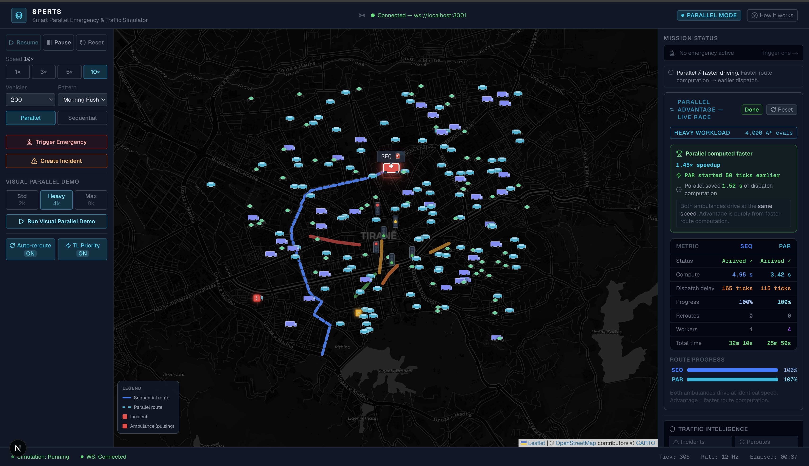
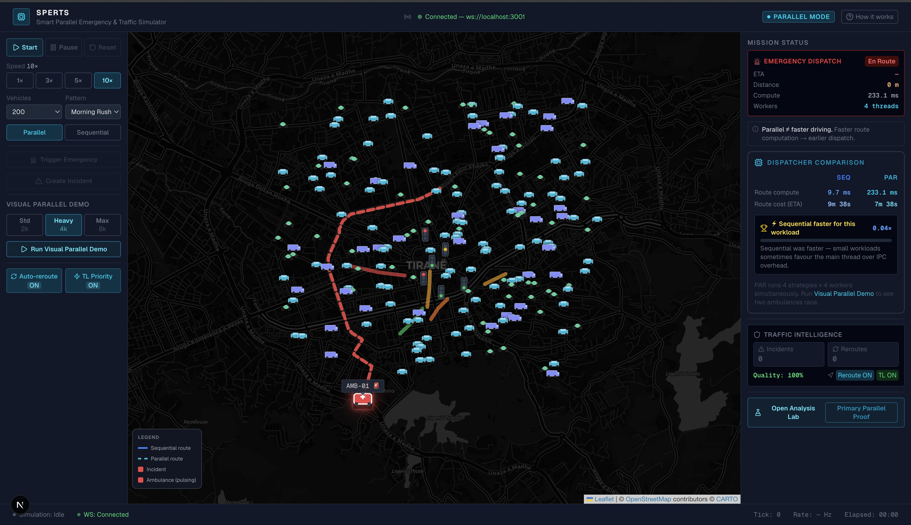
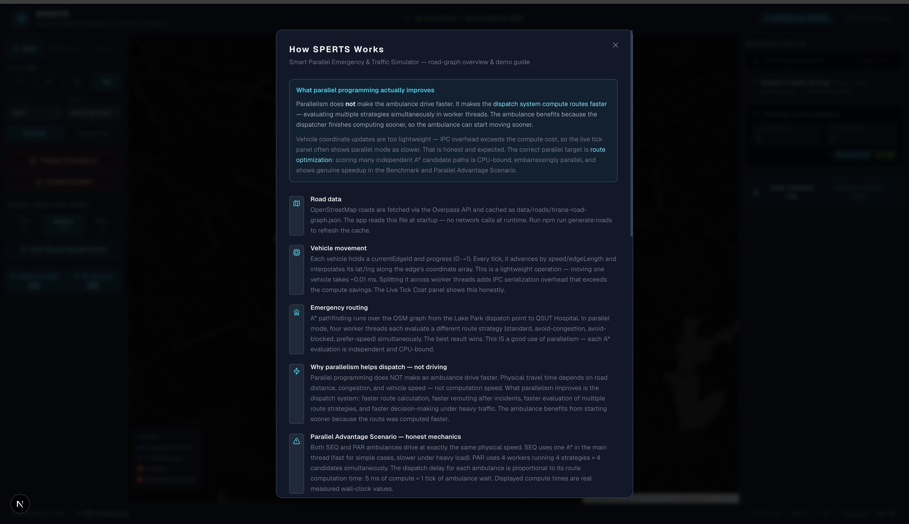
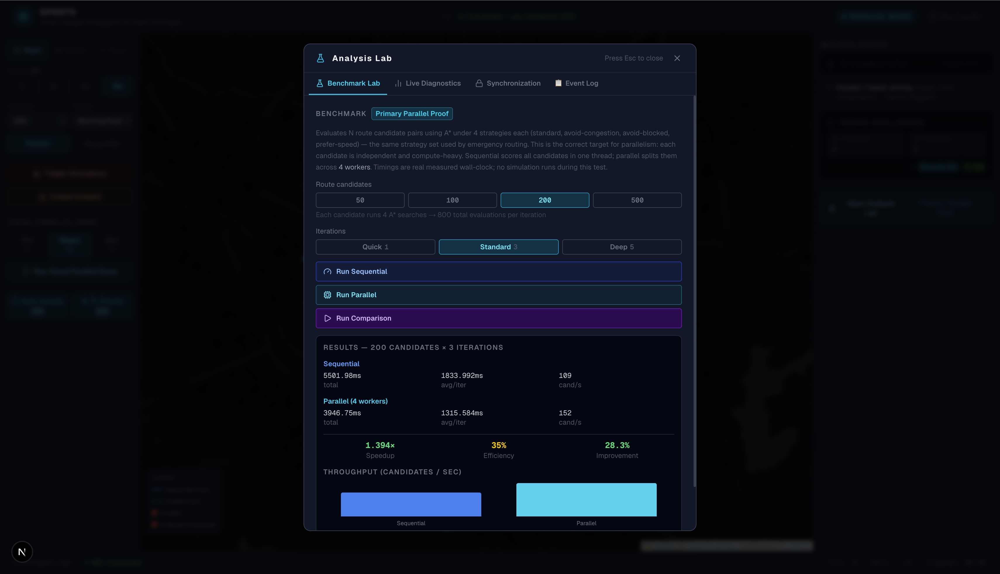

# SPERTS — Smart Parallel Emergency Response & Traffic Control Simulator

A real-time city traffic simulator that demonstrates the practical impact of **parallel programming** on emergency dispatch systems, built on a real OpenStreetMap road graph of Tirana, Albania.

All timing values shown in the interface — route compute times, benchmark speedups, dispatch delays — are **real measured wall-clock values** from `performance.now()`. Nothing is estimated or hardcoded.

---

## Table of Contents

1. [Project Overview](#1-project-overview)
2. [The Core Idea](#2-the-core-idea)
3. [Key Features](#3-key-features)
4. [Screenshots](#4-screenshots)
5. [Parallel Programming — What, Why, and How](#5-parallel-programming--what-why-and-how)
6. [Parallel Concepts Used](#6-parallel-concepts-used)
7. [Architecture](#7-architecture)
8. [Installation](#8-installation)
9. [Running the Project](#9-running-the-project)
10. [Demo Guide: How to See the Expected Results](#10-demo-guide-how-to-see-the-expected-results)
11. [Expected Results Summary](#11-expected-results-summary)
12. [Important Note About Parallel Overhead](#12-important-note-about-parallel-overhead)
13. [Scripts Reference](#13-scripts-reference)
14. [Technologies Used](#14-technologies-used)
15. [Academic Relevance](#15-academic-relevance)
16. [Limitations and Future Work](#16-limitations-and-future-work)

---

## 1. Project Overview

### The Problem

Emergency vehicles in dense urban environments face a fundamental challenge: every second lost in dispatch is a second lost in medical response. A city's road network is a dynamic, weighted graph where edge costs change continuously due to live vehicle traffic, incidents, congestion, and traffic signals. An ambulance dispatcher cannot rely on a pre-computed route — it must find the current best path, detect when that path degrades, and re-plan in real time.

SPERTS simulates exactly this scenario:

- An ambulance is dispatched from the **Artificial Lake park area** of Tirana, Albania
- Its destination is **QSUT University Hospital**, approximately 3.5 km north through the city centre
- The road network is derived from real **OpenStreetMap** data (**9,488 nodes, 17,388 edges**)
- **Live vehicle density** drives edge congestion every tick — more vehicles on a road means higher cost
- **Traffic pattern profiles** (Morning Rush, Evening Rush, Night, Emergency Mode) affect how strongly vehicles congest roads and how often incidents occur
- Incidents can block edges and force the ambulance to reroute from its current position
- Traffic lights near the emergency route switch to green while the dispatch is active

### Why This Is Industrially Relevant

Modern smart-city systems do exactly this at scale: cities like Singapore, Amsterdam, and Los Angeles use adaptive traffic management platforms that run continuous route optimisation loops. When an emergency is detected, the system must evaluate hundreds or thousands of candidate routes across different strategies simultaneously. The faster this computation completes, the earlier the ambulance can be dispatched.

This is a real, CPU-bound, embarrassingly parallel workload.

---

## 2. The Core Idea

> **Parallel programming does not make the ambulance drive faster.**

Physical driving speed depends on road conditions, congestion, and the ambulance's own engine — not on how fast the dispatcher's computer is. What parallelism improves is the **dispatch system**:

- Computing the optimal route faster (by evaluating multiple strategies simultaneously)
- Reacting faster to congestion changes (lower reroute computation time)
- Starting the ambulance sooner because the dispatcher finishes computing sooner

In the **Visual Parallel Demo**, two ambulances are dispatched simultaneously. Both drive at exactly the same speed. The only difference is when they start moving: each waits at the station while its dispatcher computes the route. Because the parallel dispatcher finishes computing first, it dispatches the ambulance earlier — and that head start translates directly into earlier arrival at the hospital.

---

## 3. Key Features

| Feature | Description |
|---|---|
| **Real OSM road graph** | 9,488 nodes, 17,388 edges from central Tirana via Overpass API |
| **Live vehicle simulation** | Up to 500 civilian vehicles (cars, trucks, motorcycles) moving along OSM edges |
| **Vehicle-density congestion** | Every tick, vehicles are counted per edge; density drives `edge.congestion`, which scales A\* cost and vehicle speed |
| **Traffic pattern profiles** | Morning Rush, Evening Rush, Night, Emergency Mode — affect density multiplier, incident probability, reroute sensitivity |
| **Emergency routing (A\*)** | A\* pathfinding from dispatch point to QSUT Hospital, evaluating 4 strategy variants |
| **Incidents on active route** | Manual incidents are placed 3–9 edges ahead of the ambulance's current position |
| **Automatic rerouting** | Detects blocked edges or route cost degradation; triggers re-computation from current position |
| **Traffic light priority** | Lights within 200 m of the active route switch to green during emergency |
| **Normal emergency mode** | Single ambulance; shows SEQ vs PAR compute time comparison side by side |
| **Visual Parallel Demo** | Two ambulances (SEQ blue, PAR cyan) wait for their dispatcher then race to hospital |
| **Analysis Lab (modal)** | Full benchmark runner, live diagnostics, synchronization metrics, event log |
| **WebSocket live updates** | Simulation server pushes snapshots to the browser every tick |
| **Compact command-center UI** | No-scroll dashboard; all controls, map, and key metrics visible in one screen |
| **Event timeline** | Chronological log of emergency triggered, routes computed, incidents, reroutes, arrival |

---

## 4. Screenshots

### Main Dashboard
*Compact command-center UI — map, controls, and key metrics visible in one screen without scrolling.*



### Emergency Routing
*Active ambulance dispatch: live route line, traffic congestion, incident marker, and Mission Status panel.*



### How SPERTS Works
*The "How It Works" modal explaining the parallel programming concept and demo workflow.*



### Analysis Lab
*Benchmark panel comparing sequential vs parallel route optimization — the primary parallel proof.*



---

## 5. Parallel Programming — What, Why, and How

### The Routing Workload

When the dispatcher receives an emergency call, it must answer: *"What is the best route to the hospital right now?"*

"Best" is not a single answer — it depends on the strategy:

| Strategy | What it optimises |
|---|---|
| `standard` | Minimum total travel time |
| `avoid-congestion` | Avoids highly congested edges |
| `avoid-blocked` | Routes around blocked/incident edges |
| `prefer-speed` | Prefers roads with higher base speed limits |

Each strategy produces a different edge-weight graph. Each graph requires a separate A\* search. The searches are **completely independent of each other** — they share no mutable state.

Additionally, for reliability, the dispatcher evaluates not just one pair (start → hospital) but N **candidate origin-destination pairs** around the dispatch zone. Each candidate under each strategy = one A\* call.

**Total evaluations = candidateCount × 4 strategies**

| Workload | Candidates | Total A\* calls |
|---|---|---|
| Standard | 500 | 2,000 |
| Heavy | 1,000 | 4,000 |
| Extreme | 2,000 | 8,000 |

A\* on the Tirana graph (~9,500 nodes) is non-trivial. Running 4,000 independent searches sequentially takes seconds. Running them in parallel takes a fraction of that.

### How the Parallel Workers Are Implemented

SPERTS uses **Node.js `worker_threads`** — real OS threads, not event-loop concurrency:

```typescript
// src/simulation/workers/HeavyDispatchWorkerPool.ts
import { Worker } from 'worker_threads';

const WORKER_COUNT = 4;

// Workers are spawned ONCE per scenario and kept alive.
// The road graph is serialized to each worker at initialization —
// subsequent compute calls send only the task list (~KB IPC payload).
await pool.initialize(nodes, edges);   // graph cached in worker memory
const results = await pool.compute(tasks, startId, goalId);
pool.terminate();
```

```typescript
// src/workers/heavyDispatchWorker.ts
import { parentPort } from 'worker_threads';
import { aStar } from '../simulation/pathfinding/aStar';

// Worker receives a chunk of tasks and runs A* for each
parentPort?.on('message', (msg) => {
  if (msg.type === 'init') {
    // Build adjacency maps per strategy, cache in worker memory
  }
  if (msg.type === 'compute') {
    // Run A* for each task chunk, return results
  }
});
```

### Sequential vs Parallel

```
Sequential dispatcher (main thread):
  Task 1 → A*  →
  Task 2 → A*      →
  Task 3 → A*          →
  Task 4 → A*              →   result
  Total: T1 + T2 + T3 + T4

Parallel dispatcher (4 worker threads):
  Worker 1: Task 1 → A*  →
  Worker 2: Task 2 → A*  →
  Worker 3: Task 3 → A*  →     result
  Worker 4: Task 4 → A*  →
  Total: max(T1, T2, T3, T4) ≈ T/4
```

The parallel dispatcher can compute routes and react to incidents in roughly **¼ the time** on a 4-core machine — which directly translates into the ambulance starting earlier.

### Why Vehicle Movement Is Not the Parallel Target

Moving each vehicle is a lightweight operation: read edge ID, advance progress by `speed/edgeLength`, interpolate position. For 500 vehicles this takes ~0.1–0.5 ms sequentially. Sending this data across worker IPC boundaries adds **more overhead than the computation saves**. SPERTS measures and displays this honestly in the Live Diagnostics tab of the Analysis Lab — parallel mode is often *slower* for vehicle updates, and that is intentional and expected.

The correct parallel target is route optimization: heavy, independent, CPU-bound A\* searches.

---

## 5. Parallel Concepts Used

| Concept | Implementation in SPERTS |
|---|---|
| **Task parallelism** | 4 worker threads each handle a subset of route candidate evaluations |
| **Data partitioning** | Total A\* task batch is split evenly across workers; each worker operates on its own chunk |
| **Worker thread pool** | `HeavyDispatchWorkerPool` — workers are spawned once, graph cached, reused for the full scenario |
| **Persistent worker state** | Workers pre-build adjacency maps per strategy at init; no rebuild per request |
| **Sequential vs parallel benchmarking** | Dedicated benchmark runner measures wall-clock time for both approaches on identical workloads |
| **Real measured timings** | All compute times use `performance.now()` — never estimated |
| **Speedup factor** | `speedup = seqTime / parTime` — displayed in both the Dispatcher Comparison and Analysis Lab |
| **Parallel efficiency** | `efficiency = speedup / workerCount` — shown in benchmark results |
| **Synchronization (semaphore)** | Intersections are modelled as critical sections; vehicles acquire permits before entering; blocked count tracked each tick |
| **Producer-consumer queue** | Emergency dispatch requests are enqueued by the UI (producer) and consumed by the engine tick loop (consumer) |
| **IPC overhead** | Honestly measured and displayed: vehicle movement overhead is higher in parallel because IPC cost exceeds compute savings |

> **WebSocket** is not parallelism. It is a real-time communication channel between the simulation server and the browser dashboard. The server runs on Node.js and the frontend runs in the browser as separate processes communicating over a single connection.

---

## 6. Architecture

```
┌─────────────────────────────────────────┐
│         Browser (Next.js Dashboard)     │
│   Map · Controls · Metrics · Charts     │
└────────────────┬────────────────────────┘
                 │ WebSocket (ws://localhost:3001)
                 │ Live snapshots every tick
┌────────────────▼────────────────────────┐
│         Node.js Simulation Server       │
│         server/index.ts                 │
└────────────────┬────────────────────────┘
                 │
┌────────────────▼────────────────────────┐
│         SimulationEngine                │
│  · Tick loop (setInterval)              │
│  · Vehicle movement                     │
│  · Congestion update (vehicle density)  │
│  · Incident management                  │
│  · Emergency routing                    │
│  · Rerouting logic                      │
│  · Traffic light priority               │
└──────────┬──────────────┬───────────────┘
           │              │
┌──────────▼──────┐  ┌────▼────────────────┐
│SequentialExec.  │  │  ParallelExecutor   │
│ main thread     │  │  worker_threads     │
│ vehicles / A*   │  │  A* route batches   │
└─────────────────┘  └─────────────────────┘
           │
┌──────────▼────────────────────────────────┐
│  A* Pathfinding · Road Graph (OSM)        │
│  IncidentManager · SemaphoreManager       │
│  EmergencyRouter · BenchmarkRunner        │
└───────────────────────────────────────────┘
```

### Key Directories

| Directory | Purpose |
|---|---|
| `app/` | Next.js App Router entry point and layout |
| `src/components/` | React components: dashboard, map, analytics, controls, UI |
| `src/simulation/engine/` | `SimulationEngine.ts` — the main tick loop and all simulation logic |
| `src/simulation/pathfinding/` | A\* implementation, road graph types, edge cost function |
| `src/simulation/emergency/` | `EmergencyRouter` — wraps A\* with strategy selection and parallel execution |
| `src/simulation/incident/` | `IncidentManager` — incident lifecycle and placement |
| `src/simulation/workers/` | `HeavyDispatchWorkerPool` — manages 4 persistent worker threads |
| `src/workers/` | `heavyDispatchWorker.ts` — the actual worker thread code run by Node.js |
| `src/websocket/` | `WebSocketServer`, `MessageRouter`, `BroadcastManager` |
| `src/store/` | Zustand stores (emergencyStore, vehicleStore, metricsStore, etc.) |
| `src/services/` | `websocketService.ts` — applies incoming snapshots to stores |
| `scripts/` | `generateRoads.ts` — fetches OSM road data and caches it |
| `data/roads/` | `tirana-road-graph.json` — cached OSM graph (9,488 nodes, 17,388 edges) |

---

## 7. Installation

**Prerequisites:** Node.js 18+ and npm.

```bash
# Clone the repository
git clone https://github.com/artjolzaimii/smart-parallel-emergency-traffic-simulator.git
cd smart-parallel-emergency-traffic-simulator

# Install dependencies
npm install

# Fetch and cache the OpenStreetMap road graph
npm run generate:roads
```

The `generate:roads` script calls the Overpass API, downloads all road edges for central Tirana, and writes `data/roads/tirana-road-graph.json`. This file is required for realistic congestion and routing behaviour.

> **If `generate:roads` fails** (network unavailable, API timeout): the simulation falls back to a minimal 18-node mock graph. The demo still runs, but benchmark speedups will appear trivial because A\* on 18 nodes takes ~0.01 ms — IPC overhead dominates at that scale. Run `generate:roads` when possible.

---

## 8. Running the Project

```bash
npm run dev:all
```

This starts both servers concurrently:

| Server | URL | Role |
|---|---|---|
| Next.js frontend | http://localhost:3000 | Dashboard UI |
| WebSocket backend | ws://localhost:3001 | Simulation engine |

The frontend auto-connects to the WebSocket server on load. The connection status is shown in the top-right corner of the header.

---

## 9. Demo Guide: How to See the Expected Results

### A. Basic Simulation Test

**Goal:** Verify the simulation runs and vehicles move on real roads.

1. Open `http://localhost:3000`
2. In the **left sidebar**, set **Vehicles** to `100`
3. Set **Pattern** to `Morning Rush`
4. Set **Speed** to `3×`
5. Click **Start**
6. Observe ~100 vehicle dots moving along real Tirana road edges on the map
7. The right panel shows **Congestion %** — this is the real average edge congestion computed from vehicle positions
8. Increase vehicles to `500` — congestion percentage should rise visibly
9. Switch to **Night — Low** pattern — congestion should drop significantly (density multiplier drops from 1.6× to 0.25×)

**Expected:** Congestion % changes with vehicle count and traffic pattern. These values drive A\* edge costs.

---

### B. Normal Emergency Routing Test

**Goal:** See the ambulance dispatch, route comparison, and rerouting.

1. With simulation running, click **Trigger Emergency**
2. A blue route line appears on the map from the lake park to QSUT Hospital
3. The **Mission Status** card on the right updates: status, ETA, distance, compute time
4. The **Dispatcher Comparison** card appears showing SEQ vs PAR compute times side by side
5. Click **Create Incident**
   - An incident (orange/red marker) appears 3–9 edges ahead of the ambulance's current position on the route
   - The route may change (polyline updates on map)
   - **Reroutes** count increments in Mission Status
   - **ETA** updates to reflect the new route
6. Check the console (`npm run dev:websocket` terminal) for logs:
   ```
   [Traffic] tick=45 vehicles=100 avgCongestion=18.3% scenario=morning-rush
   [Routing] Reroute triggered — reason=blocked oldCostS=312.4 currentCostS=Infinity
   [Routing] ETA changed after reroute: 312.4s → 287.1s strategy=avoid-blocked
   ```

**Expected:** One ambulance dispatched; both SEQ and PAR compute times shown; incident on active route triggers reroute.

---

### C. Visual Parallel Demo Test

**Goal:** Visually see the parallel advantage — earlier dispatch, same driving speed.

1. Click **Reset** to clear any active emergency
2. In the sidebar under **Visual Parallel Demo**, select workload **Heavy** (4,000 A\* evals)
3. Click **Run Visual Parallel Demo**
4. Watch the map — **two ambulances** appear:
   - 🔵 **SEQ** (blue) — sequential dispatcher, evaluates all A\* calls in one thread
   - 🟦 **PAR** (cyan) — parallel dispatcher, splits evaluations across 4 worker threads
5. Both ambulances wait at the start position while their dispatcher computes
6. PAR should start moving **earlier** — because the parallel dispatcher finishes computing first
7. Both ambulances drive at **identical speed** once moving
8. The **Parallel Advantage Summary** card on the right shows:
   - SEQ compute time (e.g., `4,200 ms`)
   - PAR compute time (e.g., `1,050 ms`)
   - Speedup factor (e.g., `4.0×`)
   - Dispatch delay difference (e.g., `PAR started 105 ticks earlier`)
   - Route progress bars showing the head start

9. After both arrive, the results **persist** on screen — click **Reset** to clear

> Note: the speedup depends on your hardware. On machines with fewer CPU cores, the speedup may be smaller. This is expected and reflects real parallel programming behaviour.

**Expected:** PAR dispatches before SEQ, same physical driving speed, real measured compute times.

---

### D. Benchmark / Analysis Lab Test

**Goal:** Get the primary, repeatable proof of parallel speedup.

1. Click **Open Analysis Lab** (right panel, bottom)
2. The modal opens on the **Benchmark Lab** tab
3. Under **Route candidates**, select `200`
4. Under **Iterations**, select `Standard (3)`
5. Click **Run Comparison**
6. Wait for both sequential and parallel runs to complete
7. Results show:
   - Sequential: total ms, avg per iteration, candidates/sec
   - Parallel (4 workers): same metrics
   - **Speedup**: `seqTime / parTime` (typically 2–4× on a modern laptop)
   - **Efficiency**: `speedup / 4` (100% efficiency = perfect linear scaling)
   - A bar chart comparing throughput

8. Switch to the **Live Diagnostics** tab — observe the `Live Tick Cost` bars. In parallel mode, vehicle tick cost is often *higher* than sequential (IPC overhead). This is honest and expected — see Section 11.

**Expected:** Parallel benchmark faster than sequential at 200+ candidates. The larger the candidate count, the stronger the speedup as fixed IPC overhead becomes proportionally smaller.

---

### E. Scenario / Traffic Pattern Test

**Goal:** Confirm traffic patterns affect real routing and congestion.

| Step | Morning Rush | Night — Low |
|---|---|---|
| Start simulation, 200 vehicles | High congestion | Low congestion |
| Congestion % metric | ~30–50% | ~3–8% |
| Trigger Emergency, note ETA | Higher ETA | Lower ETA |
| Incident probability | Incidents appear frequently (auto) | Incidents rare |
| Rerouting sensitivity | Reroutes at 15% cost increase | Reroutes at 35% cost increase |

1. Start simulation with `200` vehicles and **Morning Rush**
2. Note the **Congestion %** in the right panel
3. Trigger Emergency and note the **ETA** in Mission Status
4. Switch to **Night — Low** while running (congestion drops instantly)
5. Note that ETA shortens because edge costs are lower
6. Switch to **Emergency Mode** — auto-dispatch triggers if simulation is running; incidents appear more frequently

---

## 10. Expected Results Summary

| Test | What You Should See |
|---|---|
| 50 vs 500 vehicles (Morning Rush) | Congestion % rises with vehicle count; ETA increases; A\* may pick a different route |
| Morning Rush vs Night | Night has lower congestion, faster ETA, fewer incidents |
| Create Incident during emergency | Incident appears on active route; reroute triggers; ETA updates |
| Visual Parallel Demo (Heavy workload) | PAR starts moving before SEQ; both arrive, but PAR arrives earlier |
| Benchmark (200+ candidates) | Parallel is faster than sequential; speedup ≥ 1.5× on most hardware |
| Benchmark (50 candidates) | Parallel may be slower — IPC overhead dominates at small workload size |
| Emergency Mode pattern | Auto-emergency triggers; more frequent incident auto-spawns |

---

## 11. Important Note About Parallel Overhead

Parallel programming is **not always faster**. This project demonstrates both sides honestly.

**Vehicle movement (lightweight task):**  
Moving each vehicle takes ~0.001 ms. With 500 vehicles, the total sequential cost is ~0.5 ms. Sending vehicle data across worker IPC boundaries adds ~2–5 ms of overhead per tick. For this task, parallel mode is *slower*. This is measured and shown in the **Live Diagnostics** tab — the bar chart will show parallel tick cost ≥ sequential.

**Route optimization (heavy task):**  
Running 1,000 A\* searches on a 9,488-node graph takes seconds sequentially. Each search is independent. With 4 workers, the same workload takes roughly ¼ the time. The fixed overhead (worker spawning, IPC, result aggregation) is a small fraction of the compute cost. For this task, parallel mode is faster — and the speedup is meaningful.

The lesson: **parallelism pays off when the task is CPU-bound, independent, and large enough to amortize communication overhead.** This project was specifically designed to show that distinction clearly.

---

## 12. Scripts Reference

| Script | Command | Description |
|---|---|---|
| Start dev server | `npm run dev` | Next.js frontend only (port 3000) |
| Start WS server | `npm run dev:websocket` | Simulation backend only (port 3001) |
| Start both | `npm run dev:all` | Frontend + backend concurrently (recommended) |
| Production build | `npm run build` | TypeScript compile + Next.js build |
| Fetch road graph | `npm run generate:roads` | Download OSM data and write `data/roads/tirana-road-graph.json` |
| Lint | `npm run lint` | ESLint checks |

---

## 13. Technologies Used

| Technology | Role |
|---|---|
| **Next.js 16** (App Router) | Frontend framework; serves the dashboard |
| **TypeScript** | Type-safe code across frontend and backend |
| **Tailwind CSS** | Utility-first styling for the compact command-center UI |
| **React Leaflet** | Map rendering with OpenStreetMap tiles (CARTO Dark basemap) |
| **OpenStreetMap / Overpass API** | Real road graph data for Tirana |
| **ws** | WebSocket server library for the simulation backend |
| **Node.js `worker_threads`** | True OS-level parallel threads for route computation |
| **Zustand** | Lightweight client-side state management |
| **Recharts** | Bar charts in the Analysis Lab benchmark results |
| **concurrently** | Run Next.js and WebSocket server in one terminal |
| **tsx** | TypeScript execution for the server and scripts |

---

## 14. Academic Relevance

SPERTS was built as a practical demonstration of parallel programming concepts from a university Parallel Programming course:

| Course Concept | Where It Appears in SPERTS |
|---|---|
| **Task decomposition** | A\* route evaluations are split into independent task chunks |
| **Data partitioning** | Candidate batch divided evenly across 4 workers |
| **Thread pool** | `HeavyDispatchWorkerPool` — persistent workers with cached state |
| **Parallel speedup** | `S = T_seq / T_par` — measured and displayed in real time |
| **Parallel efficiency** | `E = S / p` where `p = 4` — shown in benchmark results |
| **Parallel overhead** | IPC serialization cost — honestly measured and visualised |
| **Amdahl's Law** | Visible: small workloads (50 candidates) show diminishing returns; large workloads (2,000) show near-linear speedup |
| **Synchronization** | Semaphore-based intersection control; producer-consumer emergency queue |
| **Critical section** | Each intersection node is a critical section; vehicles acquire permits before entering |
| **Embarrassingly parallel** | Route candidate evaluations — zero shared state between tasks |
| **Sequential baseline** | Every parallel run is compared to an identical sequential run on the same data |

The project deliberately demonstrates that not every task benefits from parallelism (vehicle movement is the counterexample) while identifying the workload that does (route optimization). This distinction is central to understanding when to parallelise.

---

## 15. Limitations and Future Work

### Honest Limitations

| Limitation | Explanation |
|---|---|
| Simulated traffic, not live | Vehicles are generated randomly on OSM edges; they do not reflect real-time traffic flows |
| Cached road graph | OSM data is fetched once via `generate:roads`; the graph does not update with construction or closures |
| Hardware-dependent speedup | Benchmark results depend on the machine's CPU core count and single-thread speed |
| No OpenMP or MPI | The project runs in the TypeScript/Node.js ecosystem; true shared-memory parallelism (OpenMP) or distributed message-passing (MPI) are not available in this environment |
| Single-city scope | The simulation covers central Tirana only; scaling to a full city or multi-city model would require distributed architecture |
| 4 workers fixed | Worker count is hardcoded to 4; dynamic scaling based on available cores is not implemented |

### Potential Future Work

- **GPU-accelerated A\*** — offload graph traversal to the GPU for hundreds of concurrent searches
- **Distributed zones with MPI-style messaging** — split the city into geographic zones, each handled by a separate Node.js process communicating via message passing
- **Live traffic API integration** — connect to a real traffic data provider (e.g., TomTom, HERE) and update edge congestion in real time
- **Dynamic worker count** — detect available CPU cores at startup and spawn workers accordingly
- **Multi-vehicle emergency routing** — coordinate multiple ambulances simultaneously, avoiding conflicts at intersections
- **Reinforcement learning dispatcher** — train an agent to choose strategies based on historical congestion patterns

---

*Built for the Parallel Programming Course 2026.*  
*Road data: © OpenStreetMap contributors, fetched via the Overpass API. ~Artjol Zaimi*
